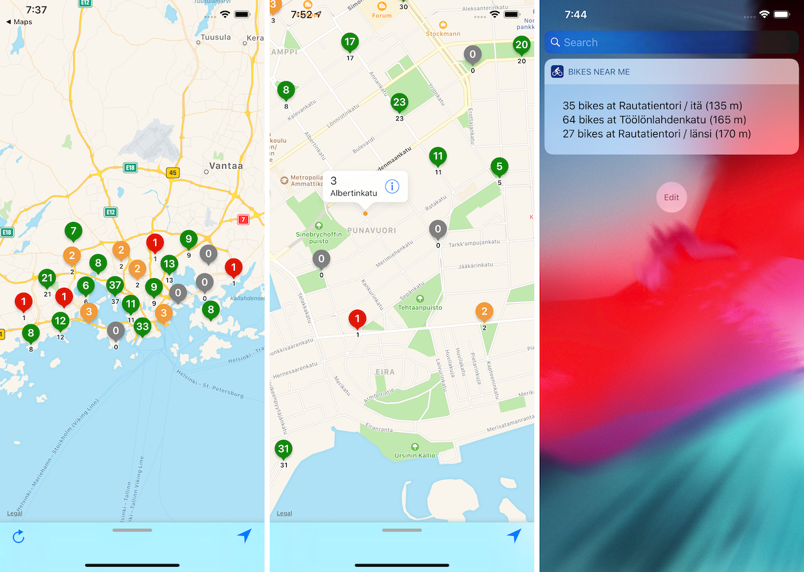

# Helsinki City Bikes Near Me

&nbsp;

An iOS app to list the Helsinki city bikes near your location.

The app lists the information on a map. There is also a Today widget
to quickly see the status of the nearest three stations.

Note that this is a third party app, and is not affiliated with HSL or
the City Bike service.

## Use Case

Helsinki city provides a bike service in the non-winter months. The
bikes are available at docking stations spread throughout the city.

https://www.hsl.fi/en/citybikes

The city bike service also provides a map that lists the stations, and
the number of bikes currently available at each of those.

https://kaupunkipyorat.hsl.fi/en/stations

While this map is great (thanks!), it is often a bit cumbersome to use
for the common case where one is only interested in the number of
bikes available at the docking stations in one's near vicinity, so
that one can quickly decide which way to head.

This app provides that information in a glance.

## API

The good folks in the Finnish government have provided an simple, easy
to use, open source and realtime API that provides the city bike
information.

https://digitransit.fi/en/

> The APIs hosted at api.digitransit.fi are publicly available for all
  and require no credentials. If you want to improve or modify them in
  some way, you can either contribute to the projects through
  https://github.com/HSLdevcom or host your own APIs based on those
  sources.

Kiitos Paljon!

## License

All source code is licensed under the [MIT License](LICENSE).
